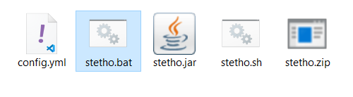

# Stetho

Stetho est un outil simple conçu pour vérifier périodiquement l'état (actif ou inactif) d'une liste d'URL. Il offre un moyen direct de surveiller la disponibilité des ressources web et d'afficher leurs statuts en temps réel via une interface web conviviale.

## Fonctionnalités

- **Surveillance des URL** : Stetho vérifie périodiquement la disponibilité des URL configurées dans le fichier `config.yml`.
- **Interface Utilisateur** : Consultez en direct le statut des URL surveillées facilement à l'adresse [http://localhost:8282/](http://localhost:8282/).
- **Configuration** : Personnalisez les URL à surveiller et l'intervalle de vérification directement dans le fichier `config.yml`.
- **Open Source** : Sous licence MIT, Stetho est gratuit à utiliser, modifier et distribuer.

## Pour lancer :

Téléchargez le fichier zip, décompressez-le, puis exécutez le fichier `.bat` si vous êtes sous Windows, ou `.sh` sinon.

## Licence 

MIT
